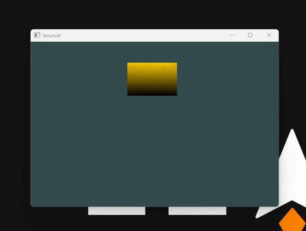

# **The Bouncing Square: bouncer**

1. **Moving the Square**: control the movement of the square using the arrow keys on the keyboard.
   - ⬅️ **left arrow key** moves towards the left.
   - ➡️ **right arrow key** moves towards the right.
   - ⬆️ **up arrow key** moves upwards.
   - ⬇️ **down arrow key** moves downwards.
2. Basically the object has the tendency to keep smashing the edges of the window and bounce back. A user's controls sort of guides it from doing that. 
3. **Exiting the Application**: can exit the application by pressing the **Escape key**. This closes the window and terminates the program.
